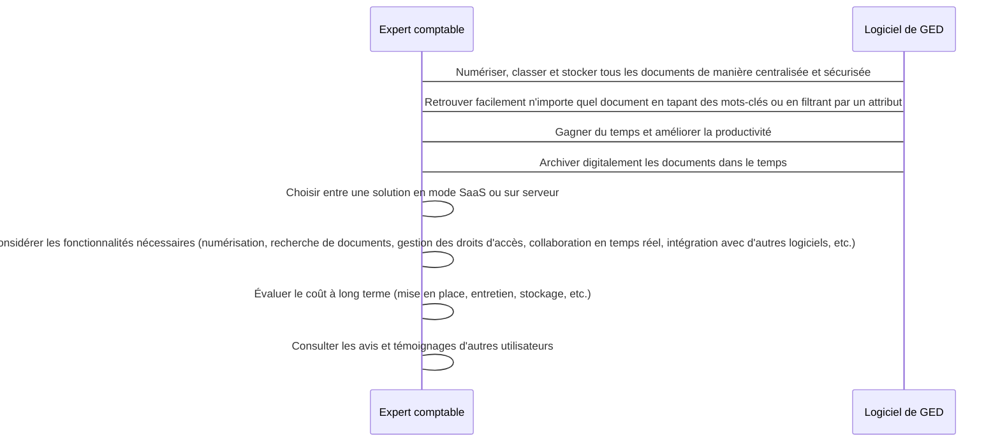

```mermaid
sequenceDiagram
    participant Expert comptable
    participant Logiciel de GED
    Expert comptable->Logiciel de GED: Numériser, classer et stocker tous les documents de manière centralisée et sécurisée
    Expert comptable->Logiciel de GED: Retrouver facilement n'importe quel document en tapant des mots-clés ou en filtrant par un attribut
    Expert comptable->Logiciel de GED: Gagner du temps et améliorer la productivité
    Expert comptable->Logiciel de GED: Archiver digitalement les documents dans le temps
    Expert comptable->Expert comptable: Choisir entre une solution en mode SaaS ou sur serveur
    Expert comptable->Expert comptable: Considérer les fonctionnalités nécessaires (numérisation, recherche de documents, gestion des droits d'accès, collaboration en temps réel, intégration avec d'autres logiciels, etc.)
    Expert comptable->Expert comptable: Évaluer le coût à long terme (mise en place, entretien, stockage, etc.)
    Expert comptable->Expert comptable: Consulter les avis et témoignages d'autres utilisateurs
```

