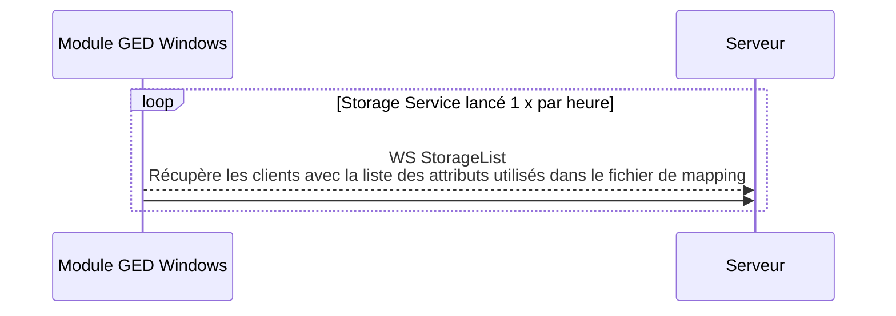

```mermaid
sequenceDiagram  
 Participant GED as Module GED Windows
 Participant S as Serveur
 loop Storage Service lancé 1 x par heure
 GED-->>S: WS  StorageList <br> Récupère les clients avec la liste des attributs utilisés dans le fichier de mapping
 GED->>S: 
 end
```

