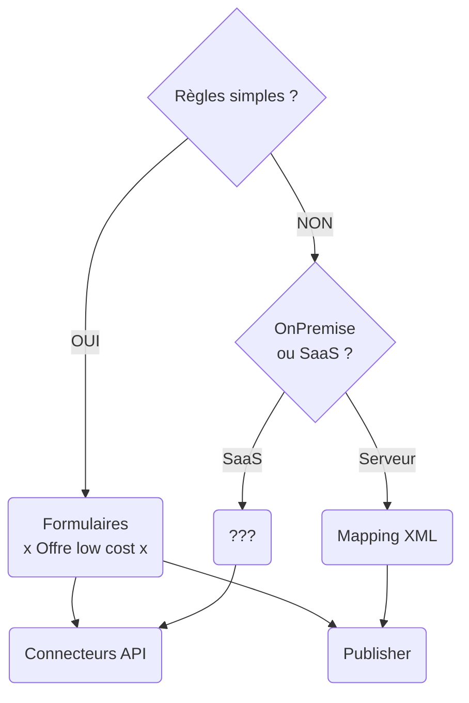
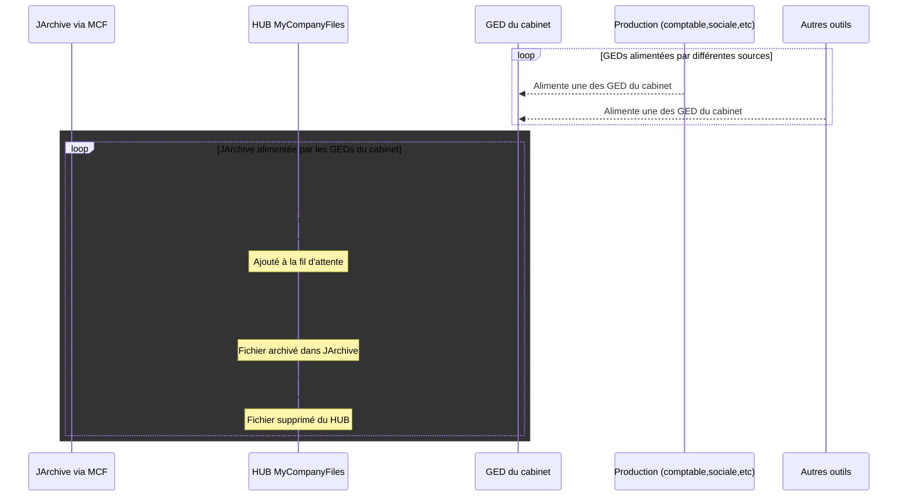

# JArchive 

## Modèle économique

```mermaid
graph TD
Q1{Règles simples ?}-->|OUI| F
F(Formulaires<br>x Offre low cost x) --> C(Connecteurs API) & P(Publisher)
Q1 -->|NON| Q2{OnPremise<br> ou SaaS ?}
Q2 -->|SaaS| R1(???) --> C
Q2 -->|Serveur| M(Mapping XML) --> P
```

## Vulgarisation technique

```mermaid
sequenceDiagram  
 Participant JA as JArchive via MCF
 Participant MCF as HUB MyCompanyFiles
 Participant GED as GED du cabinet
 Participant PROD as Production (comptable,sociale,etc)
 Participant OCR as Autres outils
 loop GEDs alimentées par différentes sources
 PROD-->>GED: Alimente une des GED du cabinet
 OCR -->>GED: Alimente une des GED du cabinet
 end
 rect rgb
 loop JArchive alimentée par les GEDs du cabinet 
 MCF-->>GED: Récupère les derniers évènementes de la GED 
 GED->>MCF: 
 MCF->>MCF: Ajoute dans une fil d'attente <br>les fichiers vérifiant une règle de mapping
 Note over MCF: Ajouté à la fil d'attente
 MCF-->>GED: Récupère les fichiers et les métadonnées voulues
 GED->>MCF: 
 MCF->>JA: Envoie les fichiers avec les métadonnées associées
 JA-->>MCF:    
 Note over MCF: Fichier archivé dans JArchive
 MCF->>MCF: Supprime le fichier du HUB MCF
 Note over MCF: Fichier supprimé du HUB
 end
 end
```

- [ ] 