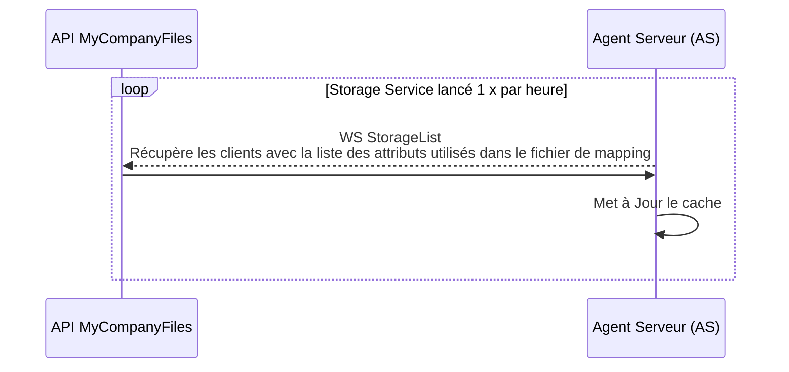
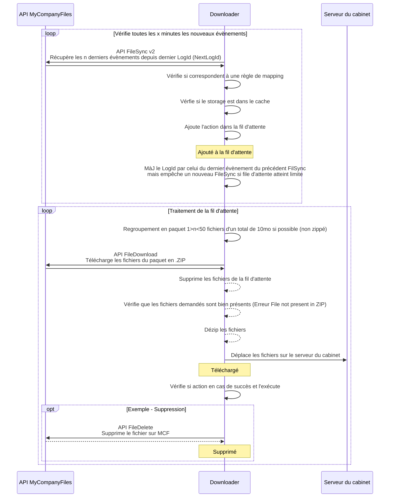
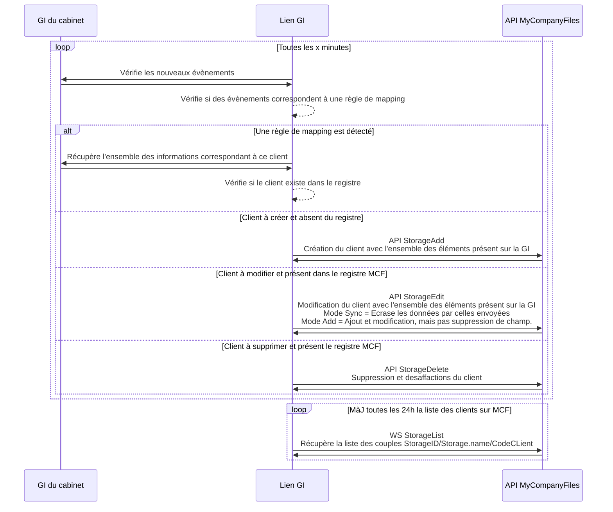
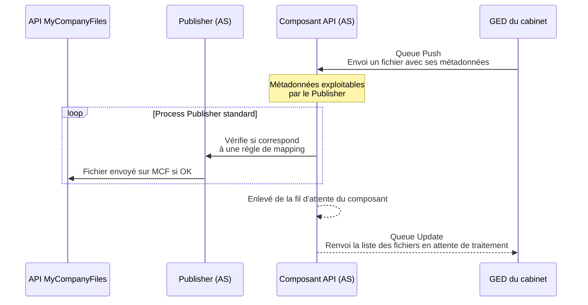

[toc]

# Fonctionnement technique AS

## Storage Service ( MàJ du cache)

## Publisher

~~~mermaid
sequenceDiagram  
 Participant MCF as API MyCompanyFiles
 Participant PL as Publisher (AS)
 Participant GED as GED du cabinet
 loop Vérifie toutes les minutes les nouveaux évènements (sleep)
 PL-->>GED: Récupère la liste des derniers évènements
 GED->>PL: 
   PL->>PL: Enlève de la liste les évènement correspondants à des clients absents du registre
   PL->>PL: Ajoute dans la fil d'attente les évènement vérifiant 1+ règles de mapping
   Note over PL: Ajouté à la fil d'attente
 end
loop Traitement de la fil d'attente en continu
  PL-->>GED: Récupère  le fichier de la fil d'attente 
   GED->>PL: 
  PL->>PL: Calcul le MD5 du fichier local
  PL-->>MCF: WS FileInfo   Vérifie si le fichier existe sur MCF (pas d'erreur 401) et récupère son MD5
  MCF->>PL: 
  PL->>PL: Si fichier existe pas ou MD5 != du fichier local
 PL->>MCF: WS FileUpload   Envoie le fichier à l'emplacement voulu
 MCF-->>PL: 
  Note over PL: Publié
  PL->>PL: Vérification si action en cas de succès et l'exécute
  opt Actions optionnelles
  PL->>GED: Suppression, déplacement, renommages, etc
  GED-->>PL: 
  end
 end
~~~

## Downloader

## Lien GI 

## Publisher - Composant API

